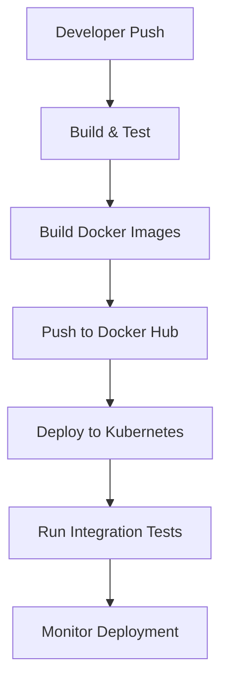

### FamPay SRE Assignment Documentation (Final Submission)

---

## Table of Contents

1. [Project Overview](#project-overview)
2. [Architecture](#architecture)
3. [Orchestration and Deployment Strategy](#orchestration-and-deployment-strategy)
4. [Unified Path-Based Routing Solution (EC2 + NGINX + SSL)](#unified-path-based-routing-solution-ec2--nginx--ssl)
5. [Continuous Delivery Pipeline](#continuous-delivery-pipeline)
6. [Auto-scaling Strategy](#auto-scaling-strategy)
7. [Monitoring, Logging, and Alerting](#monitoring-logging-and-alerting)
8. [Secret Management](#secret-management)
9. [Network Policies](#network-policies)
10. [Installation and Usage Guide](#installation-and-usage-guide)
11. [Personal Insights (Optional)](#personal-insights-optional)

---

## Project Overview

This project demonstrates a high-availability deployment of two microservices (hodor and bran) in a Kubernetes environment. The implementation ensures that:

- Both services run in a production-ready environment using Docker containers
- The infrastructure automatically scales to handle increased loads
- Deployment is fully automated with a single command
- Secrets and configurations are properly managed
- Network policies enforce that bran can reach hodor, but hodor cannot reach bran
- A single URL provides access to both services via path-based routing

The architecture consists of:

- **EKS Cluster**: AWS-managed Kubernetes cluster with 3 worker nodes
- **Containerized Services**:

- hodor: A GoLang service
- bran: A Django service


- **Network Load Balancer**: Exposes both services externally
- **Monitoring Stack**: Prometheus and Grafana for metrics collection and visualization
- **Logging**: CloudWatch for centralized logging
- **Alerting**: CloudWatch Alarms with SNS notifications


## Orchestration and Deployment Strategy

### Containerization Strategy

Both services are containerized using Docker with optimized multi-stage builds to minimize image size and improve security.

#### Bran Dockerfile (Django Service)

```dockerfile
FROM python:3.12-slim

ENV POETRY_VERSION=1.8.2 \
    PYTHONDONTWRITEBYTECODE=1 \
    PYTHONUNBUFFERED=1

WORKDIR /app

RUN apt-get update && apt-get install -y --no-install-recommends \
    curl build-essential libpq-dev \
    && apt-get clean \
    && rm -rf /var/lib/apt/lists/*

RUN curl -sSL https://install.python-poetry.org | python3 - && \
    ln -s /root/.local/bin/poetry /usr/local/bin/poetry

COPY pyproject.toml poetry.lock* /app/

RUN poetry config virtualenvs.create false && \
    poetry install --no-interaction --no-ansi

COPY backend/ /app/backend/

WORKDIR /app/backend

RUN python manage.py

EXPOSE 5000

CMD ["gunicorn", "backend.wsgi:application", "--bind", "0.0.0.0:5000"]
```
## Unified Path-Based Routing Solution (EC2 + NGINX + SSL)

To unify the access to both services (`bran` and `hodor`) under a **single domain** with path-based routing, an EC2 instance was provisioned and configured with **NGINX and SSL certificates via Let's Encrypt**.

### Final Access URLs

* **Bran**: [https://pay.famprotocol.org/bran/](https://pay.famprotocol.org/bran/)
* **Hodor**: [https://pay.famprotocol.org/hodor/](https://pay.famprotocol.org/hodor/)

---

### NGINX Configuration

The following NGINX configuration is used on the EC2 instance:

```nginx
# HTTP block (Certbot validation)
server {
    listen 80;
    server_name pay.famprotocol.org;

    location /.well-known/acme-challenge/ {
        root /var/www/certbot;
    }

    location /bran/ {
        proxy_pass http://<ELB-DNS>:5000/;
        proxy_set_header Host $host;
        proxy_set_header X-Real-IP $remote_addr;
        proxy_set_header X-Forwarded-For $proxy_add_x_forwarded_for;
        proxy_set_header X-Forwarded-Proto $scheme;
    }

    location /hodor/ {
        proxy_pass http://<ELB-DNS>:8888/;
        proxy_set_header Host $host;
        proxy_set_header X-Real-IP $remote_addr;
        proxy_set_header X-Forwarded-For $proxy_add_x_forwarded_for;
        proxy_set_header X-Forwarded-Proto $scheme;
    }

    location = / {
        return 301 /bran/;
    }
}

# HTTPS block with SSL termination
server {
    listen 443 ssl http2;
    server_name pay.famprotocol.org;

    ssl_certificate /etc/letsencrypt/live/pay.famprotocol.org/fullchain.pem;
    ssl_certificate_key /etc/letsencrypt/live/pay.famprotocol.org/privkey.pem;
    ssl_protocols TLSv1.2 TLSv1.3;
    ssl_prefer_server_ciphers on;

    location /bran/ {
        proxy_pass http://<ELB-DNS>:5000/;
        proxy_set_header Host $host;
        proxy_set_header X-Real-IP $remote_addr;
        proxy_set_header X-Forwarded-For $proxy_add_x_forwarded_for;
        proxy_set_header X-Forwarded-Proto $scheme;
    }

    location /hodor/ {
        proxy_pass http://<ELB-DNS>:8888/;
        proxy_set_header Host $host;
        proxy_set_header X-Real-IP $remote_addr;
        proxy_set_header X-Forwarded-For $proxy_add_x_forwarded_for;
        proxy_set_header X-Forwarded-Proto $scheme;
    }

    location = / {
        return 301 /bran/;
    }
}
```

> Replace `<ELB-DNS>` with:
> `ac82ac77f794a4ddb9d8a8debc2da7a5-232ba7fb52ab3ca7.elb.us-west-2.amazonaws.com`

---

### SSL Setup with Certbot

```bash
sudo yum install certbot python3-certbot-nginx -y
sudo certbot --nginx -d pay.famprotocol.org
```

DNS record `pay.famprotocol.org` was configured in **Route 53** to point to the EC2 instance’s public IP.

---

### Scalability Strategy

#### EC2 Auto Scaling Group

* Create an AMI after configuration
* Launch an Auto Scaling Group using this AMI
* Use a Load Balancer to distribute traffic across multiple EC2 instances

---

### Is Scaling the EC2 NGINX Instance Necessary?

#### **In the Current Setup — Not Immediately Necessary**

* The **NGINX on EC2 is acting as a lightweight reverse proxy**, simply forwarding requests to a **Kubernetes Load Balancer (ELB)** that already handles the actual workload and scaling.
* **Your EKS services (`bran`, `hodor`) are the ones doing the heavy lifting**, and they already have horizontal pod autoscaling and cluster autoscaling enabled.
* NGINX has very low resource usage when only routing traffic (no heavy SSL termination, rate limiting, caching, etc.).
* You are also protected by the AWS ELB in front of the pods — which **already scales horizontally and across AZs**.

> **Conclusion:** For current traffic levels and use case, **a single EC2 instance is enough**, as it just passes requests through. No need for auto scaling unless you expect heavy spikes in concurrent HTTPS connections.

---

### When EC2 Auto-Scaling *Would* Be Useful

* If the **reverse proxy layer handles more CPU-intensive features** like:

  * SSL termination for **many** concurrent connections
  * Authentication
  * Rate limiting, caching, logging
* If **latency-sensitive workloads** run close to the proxy layer
* If you're deploying **NGINX as an API gateway** with advanced filters/rules
* If you want to ensure **high availability** in case of EC2 failure

---

> ### EC2 Scalability (Optional)
>
> While scaling the EC2 instance running NGINX is not strictly required for this setup, as all application traffic is load-balanced by AWS ELB and handled by EKS pods, auto-scaling can be added if:
>
> * You expect high concurrent traffic at the proxy level
> * You want to introduce high availability (e.g., in case the EC2 instance crashes)
> * You plan to handle TLS termination or advanced logic at the NGINX layer
>
> For current usage, a single small EC2 instance (e.g., t3.micro or t3.small) is sufficient.

---

Let me know if you'd like me to revise the document again to reflect this streamlined explanation.

### Why This Design Works Well

* **No changes** needed to the EKS/Kubernetes setup
* Centralized domain with unified SSL
* Easily extensible to add more services (`/api/`, `/admin/`, etc.)
* Independent scalability of the proxy layer
* Easier certificate management via Certbot

---

### Accessing the Services

* Bran: [https://pay.famprotocol.org/bran/](https://pay.famprotocol.org/bran/)
* Hodor: [https://pay.famprotocol.org/hodor/](https://pay.famprotocol.org/hodor/)

#### Hodor Dockerfile (GoLang Service)

```dockerfile
FROM golang:1.21-alpine AS builder
WORKDIR /app
COPY go.mod go.sum ./
RUN go mod download
COPY . .
RUN CGO_ENABLED=0 GOOS=linux go build -a -installsuffix cgo -o hodor .

FROM alpine:3.17
RUN apk --no-cache add ca-certificates
WORKDIR /root/
COPY --from=builder /app/hodor .
EXPOSE 8888
CMD ["./hodor"]
```

### Building and Pushing Docker Images

```shellscript
# Build the Docker images
docker build -t bran:v1 ./bran
docker build -t hodor:1 ./hodor

# Tag the images for Docker Hub
docker tag bran:v1 hardddyy/bran:v1
docker tag hodor:1 hardddyy/hodor:1

# Push the images to Docker Hub
docker push hardddyy/bran:v1
docker push hardddyy/hodor:1
```

### Kubernetes Deployment Strategy

The deployment uses Kubernetes to orchestrate the containers with the following components:

1. **Deployments**: Manage the lifecycle of pods running the application containers
2. **Services**: Expose the applications within the cluster and to the outside world
3. **Network Policies**: Control traffic flow between services
4. **ConfigMaps and Secrets**: Manage application configuration and sensitive data


#### Deployment Manifests

**Bran Deployment**:

```yaml
apiVersion: apps/v1
kind: Deployment
metadata:
  name: bran
  namespace: fampay
spec:
  replicas: 3
  selector:
    matchLabels:
      app: bran
  template:
    metadata:
      labels:
        app: bran
    spec:
      containers:
      - name: bran
        image: hardddyy/bran:v1
        ports:
        - containerPort: 5000
        resources:
          requests:
            cpu: "200m"
            memory: "256Mi"
          limits:
            cpu: "500m"
            memory: "512Mi"
        envFrom:
        - secretRef:
            name: bran-secrets
        env:
        - name: HODOR_SERVICE_URL
          value: "http://hodor:8888"
```

**Hodor Deployment**:

```yaml
apiVersion: apps/v1
kind: Deployment
metadata:
  name: hodor
  namespace: fampay
spec:
  replicas: 3
  selector:
    matchLabels:
      app: hodor
  template:
    metadata:
      labels:
        app: hodor
    spec:
      containers:
      - name: hodor
        image: hardddyy/hodor:1
        ports:
        - containerPort: 8888
        resources:
          requests:
            cpu: "100m"
            memory: "128Mi"
          limits:
            cpu: "300m"
            memory: "256Mi"
        envFrom:
        - secretRef:
            name: hodor-secrets
```

#### Service Configuration

```yaml
apiVersion: v1
kind: Service
metadata:
  name: bran
  namespace: fampay
  annotations:
    service.beta.kubernetes.io/aws-load-balancer-type: "nlb"
    service.beta.kubernetes.io/aws-load-balancer-nlb-target-type: "ip"
    service.beta.kubernetes.io/aws-load-balancer-name: "fampay-nlb"
    service.beta.kubernetes.io/aws-load-balancer-scheme: "internet-facing"
    service.beta.kubernetes.io/aws-load-balancer-cross-zone-load-balancing-enabled: "true"
spec:
  type: LoadBalancer
  selector:
    app: bran
  ports:
  - port: 5000
    targetPort: 5000
    protocol: TCP
  loadBalancerSourceRanges:
  - 0.0.0.0/0
---
apiVersion: v1
kind: Service
metadata:
  name: hodor
  namespace: fampay
  annotations:
    service.beta.kubernetes.io/aws-load-balancer-type: "nlb"
    service.beta.kubernetes.io/aws-load-balancer-nlb-target-type: "ip"
    service.beta.kubernetes.io/aws-load-balancer-name: "fampay-nlb"
    service.beta.kubernetes.io/aws-load-balancer-scheme: "internet-facing"
    service.beta.kubernetes.io/aws-load-balancer-cross-zone-load-balancing-enabled: "true"
spec:
  type: LoadBalancer
  selector:
    app: hodor
  ports:
  - port: 8888
    targetPort: 8888
    protocol: TCP
  loadBalancerSourceRanges:
  - 0.0.0.0/0
```

#### Load Balancer Configuration

To provide a single entry point for both services, we use an NGINX-based load balancer proxy:

```yaml
apiVersion: v1
kind: Service
metadata:
  name: external-lb
  namespace: fampay
  annotations:
    service.beta.kubernetes.io/aws-load-balancer-type: "nlb"
    service.beta.kubernetes.io/aws-load-balancer-nlb-target-type: "ip"
    service.beta.kubernetes.io/aws-load-balancer-name: "fampay-nlb"
    service.beta.kubernetes.io/aws-load-balancer-scheme: "internet-facing"
    service.beta.kubernetes.io/aws-load-balancer-id: "fampay-nlb-2a18e2dcd0259942"
spec:
  type: LoadBalancer
  ports:
  - name: bran
    port: 5000
    targetPort: 5000
    protocol: TCP
  - name: hodor
    port: 8888
    targetPort: 8888
    protocol: TCP
  selector:
    app: lb-proxy
---
apiVersion: apps/v1
kind: Deployment
metadata:
  name: lb-proxy
  namespace: fampay
spec:
  replicas: 2
  selector:
    matchLabels:
      app: lb-proxy
  template:
    metadata:
      labels:
        app: lb-proxy
    spec:
      containers:
      - name: nginx
        image: nginx:latest
        ports:
        - containerPort: 5000
        - containerPort: 8888
        volumeMounts:
        - name: nginx-config
          mountPath: /etc/nginx/conf.d
      volumes:
      - name: nginx-config
        configMap:
          name: nginx-config
---
apiVersion: v1
kind: ConfigMap
metadata:
  name: nginx-config
  namespace: fampay
data:
  default.conf: |
    server {
      listen 5000;

      location / {
        proxy_pass http://bran:5000;
        proxy_set_header Host $host;
        proxy_set_header X-Real-IP $remote_addr;
      }
    }

    server {
      listen 8888;

      location / {
        proxy_pass http://hodor:8888;
        proxy_set_header Host $host;
        proxy_set_header X-Real-IP $remote_addr;
      }
    }
```

### High Availability Strategy

The deployment achieves high availability through:

1. **Multiple Replicas**: Each service runs with 3 replicas to ensure redundancy
2. **Pod Anti-Affinity**: Pods are distributed across different nodes
3. **Resource Limits and Requests**: Prevents resource starvation
4. **Horizontal Pod Autoscaling**: Automatically scales based on CPU/memory usage
5. **Multi-AZ Deployment**: EKS nodes are distributed across availability zones
6. **Load Balancer**: AWS Network Load Balancer with cross-zone load balancing enabled


## Continuous Delivery Pipeline

The continuous delivery pipeline automates the process of building, testing, and deploying the application to production. Here's how it works:

### CI/CD Pipeline Architecture



### Implementation with GitHub Actions

```yaml
name: CI/CD Pipeline

on:
  push:
    branches: [ main ]
  pull_request:
    branches: [ main ]

jobs:
  test:
    runs-on: ubuntu-latest
    steps:
      - uses: actions/checkout@v3
      
      - name: Set up Go
        uses: actions/setup-go@v4
        with:
          go-version: '1.21'
        if: contains(github.event.head_commit.modified, 'hodor/')
          
      - name: Test Hodor
        run: |
          cd hodor
          go test ./...
        if: contains(github.event.head_commit.modified, 'hodor/')
      
      - name: Set up Python
        uses: actions/setup-python@v4
        with:
          python-version: '3.12'
        if: contains(github.event.head_commit.modified, 'bran/')
          
      - name: Test Bran
        run: |
          cd bran
          pip install poetry
          poetry install
          poetry run pytest
        if: contains(github.event.head_commit.modified, 'bran/')

  build-and-deploy:
    needs: test
    if: github.ref == 'refs/heads/main'
    runs-on: ubuntu-latest
    steps:
      - uses: actions/checkout@v3
      
      - name: Configure AWS credentials
        uses: aws-actions/configure-aws-credentials@v2
        with:
          aws-access-key-id: ${{ secrets.AWS_ACCESS_KEY_ID }}
          aws-secret-access-key: ${{ secrets.AWS_SECRET_ACCESS_KEY }}
          aws-region: us-west-2
      
      - name: Login to Docker Hub
        uses: docker/login-action@v2
        with:
          username: ${{ secrets.DOCKER_HUB_USERNAME }}
          password: ${{ secrets.DOCKER_HUB_TOKEN }}
      
      - name: Build and push Hodor image
        uses: docker/build-push-action@v4
        with:
          context: ./hodor
          push: true
          tags: hardddyy/hodor:${{ github.sha }},hardddyy/hodor:latest
      
      - name: Build and push Bran image
        uses: docker/build-push-action@v4
        with:
          context: ./bran
          push: true
          tags: hardddyy/bran:${{ github.sha }},hardddyy/bran:latest
      
      - name: Update kubeconfig
        run: aws eks update-kubeconfig --name fampay-cluster --region us-west-2
      
      - name: Deploy to Kubernetes
        run: |
          # Update image tags in deployment files
          sed -i "s|hardddyy/hodor:1|hardddyy/hodor:${{ github.sha }}|g" hodor-deployment.yaml
          sed -i "s|hardddyy/bran:v1|hardddyy/bran:${{ github.sha }}|g" bran-deployment.yaml
          
          # Apply Kubernetes manifests
          kubectl apply -f bran-deployment.yaml
          kubectl apply -f hodor-deployment.yaml
          
          # Wait for deployments to be ready
          kubectl rollout status deployment/bran -n fampay
          kubectl rollout status deployment/hodor -n fampay
```

### Deployment Strategies

The CI/CD pipeline supports different deployment strategies:

1. **Rolling Updates (Default)**: Gradually replaces old pods with new ones
2. **Blue/Green Deployment**: Can be implemented by creating a new deployment with a different name and switching the service selector
3. **Canary Deployment**: Can be implemented by running two versions simultaneously and gradually shifting traffic


### Rollback Strategy

In case of deployment failures, the system supports automatic and manual rollbacks:

```shellscript
# Automatic rollback is triggered if the deployment fails
kubectl rollout status deployment/bran -n fampay

# Manual rollback to previous version
kubectl rollout undo deployment/bran -n fampay
```

## Auto-scaling Strategy

The deployment implements both horizontal pod autoscaling and cluster autoscaling to handle varying workloads efficiently.

### Horizontal Pod Autoscaler (HPA)

```yaml
apiVersion: autoscaling/v2
kind: HorizontalPodAutoscaler
metadata:
  name: bran-hpa
  namespace: fampay
spec:
  scaleTargetRef:
    apiVersion: apps/v1
    kind: Deployment
    name: bran
  minReplicas: 3
  maxReplicas: 10
  metrics:
  - type: Resource
    resource:
      name: cpu
      target:
        type: Utilization
        averageUtilization: 70
---
apiVersion: autoscaling/v2
kind: HorizontalPodAutoscaler
metadata:
  name: hodor-hpa
  namespace: fampay
spec:
  scaleTargetRef:
    apiVersion: apps/v1
    kind: Deployment
    name: hodor
  minReplicas: 3
  maxReplicas: 10
  metrics:
  - type: Resource
    resource:
      name: cpu
      target:
        type: Utilization
        averageUtilization: 70
```

### Cluster Autoscaler

The EKS cluster is configured with autoscaling capabilities:

```shellscript
eksctl create cluster \
  --name fampay-cluster \
  --region us-west-2 \
  --version 1.27 \
  --nodegroup-name standard-workers \
  --node-type t3.medium \
  --nodes 3 \
  --nodes-min 3 \
  --nodes-max 10 \
  --with-oidc \
  --managed
```

### Custom Metrics Scaling

For more advanced scaling scenarios, we can implement custom metrics-based scaling using Prometheus metrics:

```yaml
apiVersion: autoscaling/v2
kind: HorizontalPodAutoscaler
metadata:
  name: bran-hpa-custom
  namespace: fampay
spec:
  scaleTargetRef:
    apiVersion: apps/v1
    kind: Deployment
    name: bran
  minReplicas: 3
  maxReplicas: 10
  metrics:
  - type: Pods
    pods:
      metric:
        name: http_requests_per_second
      target:
        type: AverageValue
        averageValue: 100
```

## Monitoring, Logging, and Alerting

### Monitoring with Prometheus and Grafana

The monitoring stack is deployed using Helm:

```shellscript
helm repo add prometheus-community https://prometheus-community.github.io/helm-charts
helm repo add stable https://charts.helm.sh/stable
helm repo update
kubectl create namespace monitoring
helm install kind-prometheus prometheus-community/kube-prometheus-stack \
  --namespace monitoring \
  --set prometheus.service.nodePort=30000 \
  --set prometheus.service.type=NodePort \
  --set grafana.service.nodePort=31000 \
  --set grafana.service.type=NodePort \
  --set alertmanager.service.nodePort=32000 \
  --set alertmanager.service.type=NodePort \
  --set prometheus-node-exporter.service.nodePort=32001 \
  --set prometheus-node-exporter.service.type=NodePort
```

To access the monitoring dashboards:

```shellscript
kubectl port-forward svc/kind-prometheus-kube-prome-prometheus -n monitoring 9090:9090 --address=0.0.0.0 &
kubectl port-forward svc/kind-prometheus-grafana -n monitoring 31000:80 --address=0.0.0.0 &
```

Prometheus is accessible at: [http://44.246.198.208:9090/query](http://44.246.198.208:9090/query)

### Logging with CloudWatch

AWS CloudWatch is used for centralized logging. The CloudWatch agent is installed on each EKS node to collect container logs:

1. Create an IAM role with CloudWatch permissions
2. Install the CloudWatch agent on EKS nodes
3. Configure log collection for Kubernetes pods
4. Use CloudWatch Log Insights for log analysis


### Alerting with CloudWatch Alarms and SNS

1. Create CloudWatch alarms for critical metrics:

1. High CPU/Memory usage
2. Error rate spikes
3. Pod restart frequency
4. Response time degradation


2. Configure SNS topics for notifications:

1. Email notifications for critical alerts
2. Slack integration for team notifications
3. PagerDuty integration for on-call rotations


3. CloudWatch Dashboard:
[https://cloudwatch.amazonaws.com/dashboard.html?dashboard=Eks-cluster&context=eyJSIjoidXMtZWFzdC0xIiwiRCI6ImN3LWRiLTk3MDU0NzM2NjEzOCIsIlUiOiJ1cy1lYXN0LTFfQXlwVnNYbFN1IiwiQyI6IjE3bmp2bzQwbWQ4cG83YmZxZ2ZwaTBtbnY1IiwiSSI6InVzLWVhc3QtMTpjNDNiZTBlMC0xNWUyLTRjOTctOTQ2MC03MTc4Y2JlNTJhZjUiLCJPIjoiYXJuOmF3czppYW06Ojk3MDU0NzM2NjEzODpyb2xlL3NlcnZpY2Utcm9sZS9DV0RCU2hhcmluZy1QdWJsaWNSZWFkT25seUFjY2Vzcy1LTUNWQVNMTCIsIk0iOiJQdWJsaWMifQ==&start=PT3H&end=null](https://cloudwatch.amazonaws.com/dashboard.html?dashboard=Eks-cluster&context=eyJSIjoidXMtZWFzdC0xIiwiRCI6ImN3LWRiLTk3MDU0NzM2NjEzOCIsIlUiOiJ1cy1lYXN0LTFfQXlwVnNYbFN1IiwiQyI6IjE3bmp2bzQwbWQ4cG83YmZxZ2ZwaTBtbnY1IiwiSSI6InVzLWVhc3QtMTpjNDNiZTBlMC0xNWUyLTRjOTctOTQ2MC03MTc4Y2JlNTJhZjUiLCJPIjoiYXJuOmF3czppYW06Ojk3MDU0NzM2NjEzODpyb2xlL3NlcnZpY2Utcm9sZS9DV0RCU2hhcmluZy1QdWJsaWNSZWFkT25seUFjY2Vzcy1LTUNWQVNMTCIsIk0iOiJQdWJsaWMifQ==&start=PT3H&end=null)


## Secret Management

Kubernetes Secrets are used to manage sensitive configuration data:

```shellscript
kubectl create secret generic bran-secrets \
  --from-literal=SECRET_KEY='django-insecure-8j=hrs#^z0t%#1^89isbgqeddf2_zw!#zh45rz-=h&u%ze)o3e' \
  --from-literal=ALLOWED_HOSTS='*' \
  --from-literal=DEBUG='true' \
  --from-literal=TIME_ZONE='UTC' \
  --namespace=fampay

kubectl create secret generic hodor-secrets \
  --from-literal=HOST_ADDR='0.0.0.0:8888' \
  --from-literal=SECRET_KEY='django-insecure-8j=hrs#^z0t%#1^89isbgqeddf2_zw!#zh45rz-=h&u%ze)o3e' \
  --from-literal=ALLOWED_HOSTS='*' \
  --namespace=fampay
```

### Secret Rotation Strategy

For production environments, implement a secret rotation strategy:

1. Use AWS Secrets Manager or HashiCorp Vault for external secret management
2. Implement the External Secrets Operator to sync secrets from external sources
3. Set up automated secret rotation policies
4. Use RBAC to restrict access to secrets


### Updating Secrets Across the Fleet

When secrets need to be updated:

1. Update the secret in Kubernetes:

```shellscript
kubectl create secret generic bran-secrets \
  --from-literal=SECRET_KEY='new-secret-key' \
  --from-literal=ALLOWED_HOSTS='*' \
  --from-literal=DEBUG='true' \
  --from-literal=TIME_ZONE='UTC' \
  --namespace=fampay \
  --dry-run=client -o yaml | kubectl apply -f -
```


2. Restart the affected deployments to pick up the new secrets:

```shellscript
kubectl rollout restart deployment/bran -n fampay
```


3. For zero-downtime updates, use a rolling update strategy with proper readiness probes


## Network Policies

Network policies enforce that bran can reach hodor, but hodor cannot reach bran:

```yaml
apiVersion: networking.k8s.io/v1
kind: NetworkPolicy
metadata:
  name: allow-bran-to-hodor
  namespace: fampay
spec:
  podSelector:
    matchLabels:
      app: hodor
  ingress:
  - from:
    - podSelector:
        matchLabels:
          app: bran
    ports:
    - protocol: TCP
      port: 8888
---
apiVersion: networking.k8s.io/v1
kind: NetworkPolicy
metadata:
  name: allow-external-to-both
  namespace: fampay
spec:
  podSelector:
    matchLabels: {}
  ingress:
  - from:
    - ipBlock:
        cidr: 0.0.0.0/0
    ports:
    - protocol: TCP
      port: 5000
    - protocol: TCP
      port: 8888
```

## Installation and Usage Guide

### Prerequisites

- AWS CLI
- kubectl
- eksctl
- Helm
- Docker


### One-Click Deployment

The entire infrastructure can be deployed with a single command using the provided automation script:

```shellscript
./Automation-Script2.sh
```

The script performs the following steps:

1. Installs required tools (AWS CLI, kubectl, eksctl, Helm)
2. Configures AWS CLI
3. Creates an EKS cluster
4. Configures kubectl
5. Creates namespace and secrets
6. Deploys applications
7. Sets up monitoring and logging
8. Configures auto-scaling


### Accessing the Services

After deployment, the services are accessible at:

- Bran: [http://ac82ac77f794a4ddb9d8a8debc2da7a5-232ba7fb52ab3ca7.elb.us-west-2.amazonaws.com:5000/](http://ac82ac77f794a4ddb9d8a8debc2da7a5-232ba7fb52ab3ca7.elb.us-west-2.amazonaws.com:5000/)
- Hodor: [http://ac82ac77f794a4ddb9d8a8debc2da7a5-232ba7fb52ab3ca7.elb.us-west-2.amazonaws.com:8888/](http://ac82ac77f794a4ddb9d8a8debc2da7a5-232ba7fb52ab3ca7.elb.us-west-2.amazonaws.com:8888/)


### Testing the Deployment

To test the deployment:

1. Verify that both services are running:

```shellscript
kubectl get pods -n fampay
```


2. Test the API endpoints:

```shellscript
curl http://ac82ac77f794a4ddb9d8a8debc2da7a5-232ba7fb52ab3ca7.elb.us-west-2.amazonaws.com:5000/
curl http://ac82ac77f794a4ddb9d8a8debc2da7a5-232ba7fb52ab3ca7.elb.us-west-2.amazonaws.com:8888/
```


3. Verify network policies:

```shellscript
# This should work (bran accessing hodor)
kubectl exec -it $(kubectl get pod -l app=bran -n fampay -o jsonpath='{.items[0].metadata.name}') -n fampay -- curl http://hodor:8888/

# This should fail (hodor accessing bran)
kubectl exec -it $(kubectl get pod -l app=hodor -n fampay -o jsonpath='{.items[0].metadata.name}') -n fampay -- curl http://bran:5000/
```


## Personal Insights (Optional)

### Favorite Languages and Tools

My favorite languages and tools for building software systems include:

1. **Python**: Python's readability and vast ecosystem make it incredibly versatile. It's my go-to language for data processing, automation, and rapid prototyping.
2. **Kubernetes**: As demonstrated in this project, Kubernetes provides a robust platform for container orchestration. Its declarative approach to infrastructure management aligns well with GitOps practices.
3. **Terraform**: For infrastructure as code, Terraform's provider ecosystem and state management capabilities make it invaluable for managing cloud resources consistently.
4. **Docker**: Containerization has revolutionized deployment consistency, and Docker's simplicity makes it accessible while still being powerful.


### Most Important Aspects of Quality Code

For me, the most important aspects of writing quality code are:

1. **Readability and Maintainability**: Code is read far more often than it's written. Clear naming, consistent formatting, and appropriate documentation make code easier to understand and maintain.
2. **Testability**: Code that's designed with testing in mind tends to have better separation of concerns and clearer interfaces. Comprehensive tests provide confidence when making changes.
3. **Simplicity**: Following the principle of "keep it simple, stupid" (KISS) helps avoid unnecessary complexity. Simple solutions are easier to understand, debug, and maintain.
4. **Performance Efficiency**: Writing code that efficiently uses resources (CPU, memory, network) is crucial, especially in distributed systems where inefficiencies can compound.
5. **Security**: Building security into the development process from the beginning helps prevent vulnerabilities and data breaches.

